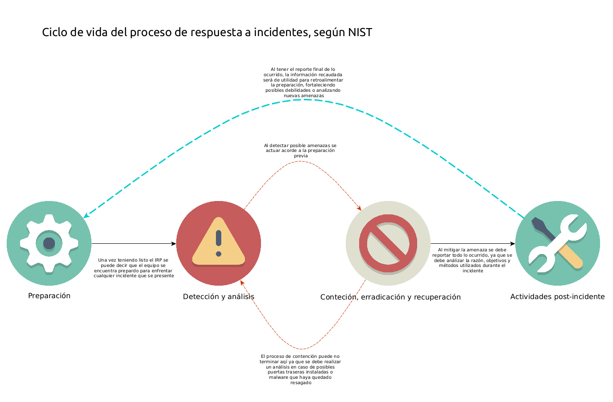
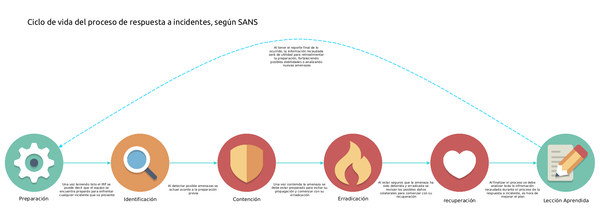

# Plan de respuesta a incidente

#### ¿Qué es un plan de respuesta a incidentes?
Un IRP (*Incident Response Plan*) se puede definir como una guiá o plan de acción que se debe seguir en el caso de que se presente una violación de ciberseguridad. Este se conforma de pasos o instrucciones diseñadas para minimizar el impacto del incidente de ciberseguirdad que se  presente sin verse afectada en los procesos de negocio o con un mínimo impacto sobre el mismo. Dentro de este *IRP* deben ir documentadas las actividades planeadas para reaccionar contra amenazas de ciberseguridad.

Debido a que todas las organizaciones son muy diferentes en cuanto a procesos y políticas el diseño de un *IRP* de igual manera debe  ser adaptado hacia los procesos informáticos que contenga la organización, diseñando un plan efectivo ante cualquier amenaza que pueda presentarse en actividades ya contempladas. Aún sabiendo que un *IRP* es único entre cada organización existen estándares que apoyan como guiás para el desarrollo del plan, estas desarrollan un plan con los mismo pasos o puntos pero siempre adaptados a las necesidades de la organización.

---
#### Estándares para un plan de respuesta de incidentes
Actualmente en la industria existen dos marcos de referencia (*Framework*) utilizados como estándar al momento de desarrollar un *IRP*, estos son desarrollados por *NIST* y *SANS*. 

**NIST**
Instituto Nacional de Estándares y Tecnología (*NIST*) es un una agencia gubernamental nacida a partir del departamento de comercio de Estados Unidos. Abarcan prácticamente todas las ramas de la tecnología donde su objetivo es promover la innovación de las tecnologías en los Estados Unidos mediante el desarrollo de metodologías, normas y avances tecnológicos que faciliten o perfeccionen las actividades comerciales.

A partir de la decada de 1990  nace el Centro de Recursos de Seguridad Informática (*CSRC*) El cual se encarga de ofrecer recursos orientados a la seguridad y privacidad de datos informáticos. Para propósitos de este articulo se hará mención de una de sus Publicaciones Especiales (*SP*) destinada al plan de respuesta a incidentes, la **SP 800-61** en su Segunda revisión actualmente establece una **Guía de manejo de incidentes de seguridad informática** la cual establece un *IRP* desarrollado en cuatro pasos:

1. Preparación
2. Detección y análisis
3. Contención, erradicación y recuperación
4. Actividades post-incidente

**SANS**
El instituto de Auditores de sistemas, Red y Seguridad (*SANS*) se estableció desde el año 1989 como una organización cooperativa de investigación y educación. Es una de las fuentes más confiables y mayormente empleada como fuente de información y capacitación sobre ciberseguridad en el mundo, además contiene y desarrolla la más grande colección de documentos e investigaciones referentes a la ciberseguridad.

El proceso de respuesta a incidentes de SANS consta de seis pasos:

1. Preparación
2. Identificación
3. Contención
4. Erradicación
5. Recuperación
6. Lección aprendida

Al momento de diseñar un *IRP* es de mucha utilidad optar por uno de los dos estándares listados anteriormente, debido al reconocimiento que han ganado durante años por expertos en seguridad que han obtenido resultados bastante favorables al momento de desarrollar un *IRP* con cualquiera e los estándares. No se puede decidir por alguno que se defina *el mejor* de todos, ya que ambos son muy populares entre especialistas de seguridad, la única recomendación es adaptar cualquiera que se escoja a las necesidades y el entorno de la organización.

---
#### Conociendo el estándar presentado por nist
Para conocer mejor el estándar presentado por *NIST* se deben comprender en que consisten cada uno de los 4 puntos a implementar sobre el *IRP*.

**Preparación**

prácticamente en este punto se proporcionan consejos básicos sobre como se debe manejar un incidente se ciberseguridad, se realizar una lista de los recursos necesarios para un incidente como por ejemplo una lista de contactos informativos, software de monitoreo y análisis, inventario de equipo y sus direcciones ip, puertos disponibles por equipo, etc. 

como buena práctica de seguridad los respaldos de información y configuración deben estar actualizados y seguros, durante la fase de preparación se debe organizar un proceso en el cual se tengan accesos a esos datos de respaldo solo por precaución.

Parte de la preparación implica conocer los vectores de ataque mas utilizados por atacantes, esto ayudará a predecir los posibles objetivos y técnicas empleadas por un atacante y de este modo centrarse en la erradicación de esas posibles amenazas. En algunas ocasiones un atacante podría utilizar un vector de ataque poco habitual, esa es la razón por la ur siempre se debe estar preparado de igual manera ante posibles vectores de ataque poco habituales.

**Detección y análisis**

Al momento de enfrentarse a un incidente de ciberseguridad se debe realizar un análisis sobre que es loq ue sucede, como primer punto se debe análizar el vector de ataque al que se enfrenta el equípo de respuesta y en base a la preparación previa tomar una decision de que medidas se deben tomar para contrarrestar la amenaza, un vector de ataque puede ser desde un ataque a los servicios web, a dispositivos de almacenamiento o incluso el uso indebido del equípo de la organización ya se a por pérdida o por una maniobra de ingeniería social.

Siempre se debe tener disponible la información de las herramientas de análisis para identificar donde puede estarse presentando un incidente de ciberseguridad, herramientas de software como detectores de intrusos (*IDS*), monitores de eventos de seguridad (*SIEM*) antivirus y los logs del sistema operativo. Esta información hace la diferencia entre contener el incidente y la pérdida de información.

**Contención, erradicación y recuperación**

La diferencia entre ambos estándares se encuentra en este punto ya que *NIST* los agrupa en uno solo, el proceso consiste e seleccionar una estrategia de contención la cual sea eficaz para evitar incrementar el daño, esta estrategia debe estar basada en el tipo de incidente, las organizaciones deben crear estratégias de contención independientes para cada tipo de amenaza.

Durante el incidente es prioritario identificar los servidores que están siendo afectados. Estos son los objetivos que deben ser contenidos en un principio para evitar la propagación, debe realizarse una validación de direcciones ip comprometidas, incidentes a base de datos o verificar canales de comunicación entre servicios que pudieran haber sido afectados.

**Actividades post-incidente**

Como punto importante se analiza la **Lección aprendida** donde se analiźan las debilidades de ciberseguridad, se comprenden nuevas vulnerabilidades y se desarrollan nuevas técnicas de protección, en caso de múltiples incidentes se pueden cubrir dentro de una sola reunión de *Lección aprendida*, esto para obtener conclusiones y desarrollar técnicas generales que mejoren la ciberseguridad.

---
#### Conociendo el estándar presentado por sans
Para conocer mejor el estándar presentado por *SANS* se deben comprender en que consisten cada uno de los 6 puntos a implementar sobre el *IRP*.

**Preparación**

Esta fase consiste en preparar al equipo para estar listos al momento de cualquier incidente que pueda presentarse, desde fallos en hardware, posibles violaciones a políticas de seguridad de la organización o intentos de ataques hacia los servicios informáticos.

Se deben tener en cuenta elementos clave que apoyen a combatir cualquier amenaza que se presente, como por ejemplo las estrategias de respuesta, documentación técnica, controles de acceso, herramientas de ciberseguridad y monitoreo e incluso contactos actualizados de encargados de cada departamento.

**Identificación**

En este punto se debe detectar cualquier operación anormal que pueda originar un incidente, para esto las herramientas clave son las herramientas de monitoreo como logs de sistema por ejemplo. La comunicación y coordinación entre el equipo es crítica en este punto para detectar cualquier amenaza en el momento apropiado.

**Contención**

El propósito principal de este punto es reducir en la mayor medida el daño que pueda ocasionarse para lo cual se puede resumir el proceso en tres puntos críticos. Como primer punto es limitar el daño lo mayor posible, esto conteniendo posibles segmentos de red afectados o deshabilitando posibles servicios comprometidos. Para el segundo paso es acceden a la copia de seguridad del sistema, esto para realizar evaluaciones de cómputo forense sobre los ambientes afectados y poder detectar todos los daños que pudiera recibir el equipo afectado. Como último punto es recomendable conservar una copia de contención a largo plazo, esto una vez restaurados los servicios afectados claro, y el uso de la copia a largo plazo consiste en un estudio detallado de las posibles brechas de seguridad afectadas durante el incidente, para as cuales apoyen a robustecer la seguridad.

**Erradicación**

Este punto consiste en la restauración de los sistemas afectados, la cual puede consistir en la limpieza y validación de los servicios afectados, o una vez contenidos haces la restauración por medio de las cópias de seguridad.

**Recuperación**

Este punto consiste en devolver todos los sistemas afectados a sus respectivos ambientes de producción, para esto es muy importante el monitoreo y pruebas del funcionamiento correcto para verificar que la amenaza ha sido erradicada completamente.

Partes importantes en este punto son el tiempo aproximado para la restauración, el plan de verificación que los sistemas han sido restaurados y ya no se encuentran comprometidos, la duración del monitoreo de posible funcionamiento anormal.

**Lección aprendida**

el punto más crítico dentro del *IRP* seria este, el cual consiste en la documentación de todo el ciclo de vida del incidente, la cual será de referencia para futuros incidentes en el cual debe describirse, que paso, como se detecto, quienes estuvieron involucrados, como se contuvo, estratégias de recuperación, vectores de ataque.

---
#### Recomendación final
Ya hemos visto las diferencias a muy grandes rasgos entre ambos estándares oficiales, pero como se mencionó anteriormente no hay un favorito general al momento de diseñar el *IRP* deseado, por lo que es algo que deberá ser decidido por el equípo de seguridad de la organización que lo requiera.

Para próximas referencias se desarrollará cm¿omo ejemplo un *IRP* de ejemplo utilizando ambos estándares para comprender su desarrollo y analizar las diferencias entre sus puntos, esto igual apoyara a cualquier entusiasta a tener una guiá al momento de desarrollar su propio *IRP* personalizado para sus necesidades.

---
Referencias:

SANS Institute - Incident Handler's Handbook - Patrick Kral ([https://www.sans.org/reading-room/whitepapers/incident/incident-handlers-handbook-33901](https://www.sans.org/reading-room/whitepapers/incident/incident-handlers-handbook-33901))

NIST - SP 800-61 Rev. 2 - Computer Security Incident Handling Guide. Paul Cichonski, Tom Millar, Tim Grance & Karen Scarfone ([https://nvlpubs.nist.gov/nistpubs/SpecialPublications/NIST.SP.800-61r2.pdf](https://nvlpubs.nist.gov/nistpubs/SpecialPublications/NIST.SP.800-61r2.pdf))

[https://www.sans.org/about/](https://www.sans.org/about/)

[https://cybersecurity.att.com/blogs/security-essentials/incident-response-steps-comparison-guide](https://cybersecurity.att.com/blogs/security-essentials/incident-response-steps-comparison-guide)

[https://www.nist.gov/about-nist](https://www.nist.gov/about-nist)

[https://csrc.nist.gov/about](https://csrc.nist.gov/about)

[https://blog.eccouncil.org/phases-of-an-incident-response-plan/](https://blog.eccouncil.org/phases-of-an-incident-response-plan/)